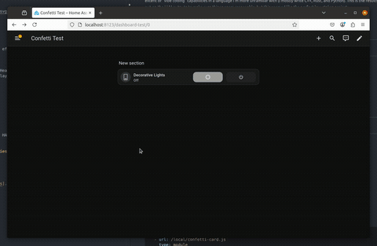

# Confetti Card

A Home Assistant Lovelace custom card that fires confetti celebrations when entity conditions become true.

I was recently making a wall dashboard with chores for my kids and wanted to make it more fun and rewarding. I also have been wanting to test the extent of "vibe coding" capabilities in a task that would take me a significant amount of time on my own (I'm not very familiar with TypeScript). This is the result! I am keeping an eye out on the LLM outputs to make sure things seem reasonable, but this seemed like the perfect low-stakes project.

[![GitHub Release][releases-shield]][releases]
[![License][license-shield]](LICENSE.md)
[](https://github.com/custom-components/hacs)
[![GitHub Activity][commits-shield]][commits]

---

<p align="center">
  
</p>

Features:

- 10 built-in effect presets: Confetti, Fireworks, Snow, Stars, Hearts, Rockets, Rainbow, Dinosaurs, Unicorn, and Overload
- Enable any combination of presets -- a random enabled effect plays each time
- Optional celebration sound effects per preset
- Condition-based triggering using Home Assistant entity states
- Visual editor for all settings

## Installation

### HACS (recommended)

TODO: This is slightly wrong! The card requires a custom repo in HACS right now.

1. Open HACS in your Home Assistant instance.
2. Go to **Frontend** and click **+ Explore & Download Repositories**.
3. Search for **Confetti Card** and click **Download**.
4. Refresh your browser.

### Manual

1. Download `confetti-card.js` from the [latest release][releases].
2. Copy it to `<config>/www/confetti-card.js`.
3. Add a resource entry in your dashboard settings:

```yaml
resources:
  - url: /local/confetti-card.js
    type: module
```

---

## Configuration

### Minimal example

```yaml
type: custom:confetti-card
conditions:
  - entity: binary_sensor.front_door
    state: 'on'
```

### Full example

```yaml
type: custom:confetti-card
sound: true
presets:
  - confetti
  - fireworks
  - stars
  - rockets
  - unicorn
conditions:
  - entity: binary_sensor.front_door
    state: 'on'
```

---

## Options

| Name           | Type     | Required     | Description                                                      | Default     |
| -------------- | -------- | ------------ | ---------------------------------------------------------------- | ----------- |
| `type`         | string   | **Required** | `custom:confetti-card`                                           |             |
| `conditions`   | list     | **Optional** | List of HA conditions -- confetti fires when all become true     | `[]`        |
| `sound`        | boolean  | **Optional** | Play the preset's celebration sound effect                       | `false`     |
| `behind_popup` | boolean  | **Optional** | Render confetti behind Bubble Card popups instead of in front    | `false`     |
| `presets`      | string[] | **Optional** | List of enabled preset IDs (a random one is chosen each trigger) | all presets |

### Available presets

| ID          | Effect                                                        |
| ----------- | ------------------------------------------------------------- |
| `confetti`  | Continuous school-pride confetti from both sides              |
| `fireworks` | Random burst explosions across the screen                     |
| `snow`      | Gentle falling snowflakes                                     |
| `stars`     | Staggered bursts of gold stars expanding outward              |
| `hearts`    | Heart-shaped particles falling from above                     |
| `rockets`   | Rocket emoji launching upward with sparkle trails             |
| `rainbow`   | Cascading rainbow arcs with a center burst finale             |
| `dinosaurs` | Dinosaur emoji stomps with debris and a volcano eruption      |
| `unicorn`   | Magical pastel sparkles with unicorn, rainbow, and star emoji |
| `overload`  | Massive wall-to-wall confetti chaos lasting 20 seconds        |

---

## Developer Guide

### Prerequisites

| Tool    | Minimum version | Notes                               |
| ------- | --------------- | ----------------------------------- |
| Node.js | 24              | Required by `custom-card-helpers@2` |
| Yarn    | 4               | Managed via Corepack                |

TypeScript, Rollup, ESLint, and all other build tools are installed locally via `yarn install` -- no global installs needed.

### Quick start -- devcontainer (recommended)

The devcontainer gives you a full HA development environment in one click with no local setup required.

1. Open the project in VS Code.
2. When prompted, click **Reopen in Container** (or run **Dev Containers: Rebuild Container**).
3. A local Home Assistant instance starts automatically at `http://localhost:8123`.
4. Log in with `dev` / `dev`.
5. The built card is served from the container and hot-reloads on every save (`yarn start` is launched automatically).

**Requires:** [Dev Containers](https://marketplace.visualstudio.com/items?itemName=ms-vscode-remote.remote-containers) extension.

### Quick start -- local

```bash
# 1. Install dependencies
yarn install

# 2. Verify the build works
yarn build

# 3. Start the development watcher
yarn start
```

Then add your local file as a Lovelace resource:

```yaml
resources:
  - url: /local/confetti-card.js
    type: module
```

Copy or symlink `dist/confetti-card.js` into your HA `www/` folder, or use the devcontainer where this is handled automatically.

### Available scripts

| Command       | Description                                            |
| ------------- | ------------------------------------------------------ |
| `yarn build`  | Lint + production bundle (minified, ES2022 output)     |
| `yarn rollup` | Production bundle only (skips lint)                    |
| `yarn start`  | Development watcher with hot reload (`rollup --watch`) |
| `yarn lint`   | ESLint across all `src/` files                         |

### Project structure

```
src/
├── confetti-card.ts    # Main card element -- fires effects on condition changes
├── editor.ts           # Visual editor -- implements LovelaceCardEditor
├── presets.ts          # Effect presets and registry (visuals + sound)
├── types.ts            # TypeScript interfaces for card config
├── conditions.ts       # Condition evaluation logic
├── const.ts            # CARD_VERSION constant
└── localize/
    ├── localize.ts     # i18n helper
    └── languages/
        ├── en.json     # English strings
        └── nb.json     # Norwegian strings
dist/
└── confetti-card.js    # Build output -- serve this to HA
```

### Adding a new preset

1. Define a new `Preset` object in `src/presets.ts` with a unique `id`, `label`, `icon`, `run()`, and `playSound()` method.
2. Add it to the `presetRegistry` array at the bottom of the file.
3. The editor and card pick it up automatically -- no other files need changes.

NOTE: LLM's are rather excellent at generating the confetti effect code, but the sound effect code is more hit-or-miss. You may want to test and tweak the sound generation parameters to get a good result.

### Adding a new language

1. Copy `src/localize/languages/en.json` to `src/localize/languages/<lang>.json`.
2. Translate the values (keep all keys identical).
3. Import and register the new translations in `src/localize/localize.ts`.

### Contributing

1. Fork the repository and create a feature branch from `master`.
2. Run `yarn build` before opening a PR -- all lint checks must pass.
3. Keep PRs focused on a single change.
4. Code style is enforced automatically by Prettier and ESLint on build.

---

## Troubleshooting

**Card not appearing after install**
Clear your browser cache or do a hard reload (`Ctrl+Shift+R` / `Cmd+Shift+R`).

**`TypeError: Class constructor cannot be invoked without 'new'`**
Your bundler is transpiling Lit's class syntax down to ES5. Ensure `rollup.config.js` has `terser({ ecma: 2020 })` and `typescript({ compilerOptions: { target: 'ES2022' } })`.

**Visual editor not opening**
Check the browser console for import errors from the dynamic `import('./editor')` in `getConfigElement`. Also confirm the `confetti-card-editor` custom element tag matches what `getConfigElement` creates.

**General Lovelace plugin troubleshooting**
See the [thomasloven wiki][troubleshooting].

---

[commits-shield]: https://img.shields.io/github/commit-activity/y/custom-cards/confetti-card.svg?style=for-the-badge
[commits]: https://github.com/custom-cards/confetti-card/commits/master
[license-shield]: https://img.shields.io/github/license/custom-cards/confetti-card.svg?style=for-the-badge
[releases-shield]: https://img.shields.io/github/release/custom-cards/confetti-card.svg?style=for-the-badge
[releases]: https://github.com/custom-cards/confetti-card/releases
[troubleshooting]: https://github.com/thomasloven/hass-config/wiki/Lovelace-Plugins
